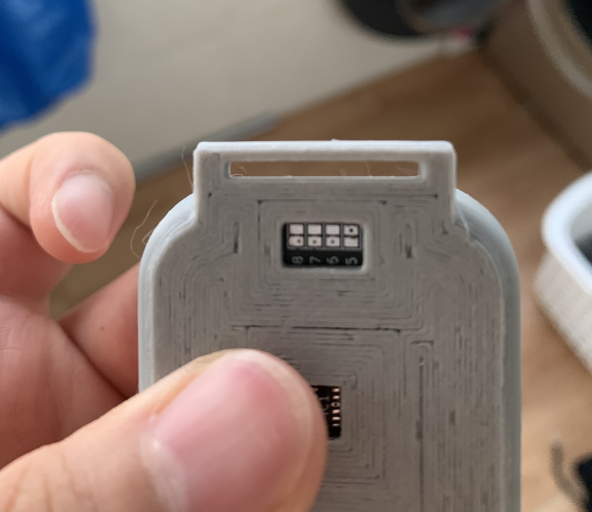
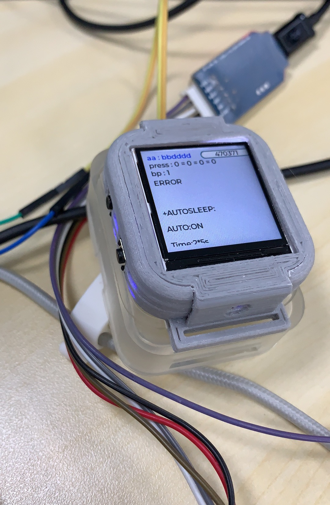
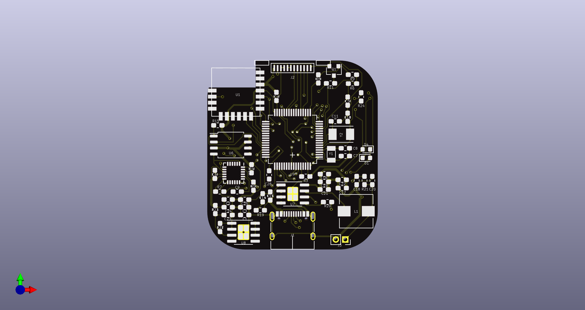
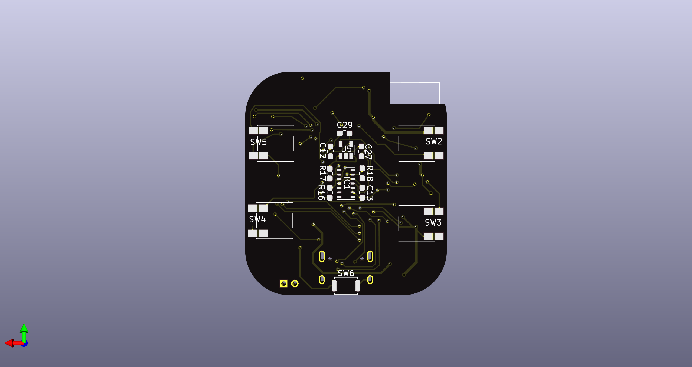

# Watch_F4
>
#### 尺寸 40x36mm
#### STM32F405RGT6
#### IP5306+MP20045
#### MPU6050
#### W25Q128JVS
#### 蓝牙主从一体模块
#### 1.44寸SPI屏
#### 背面MAX30102，用作血氧检测
#### 背面引出4个按钮引脚

### 3D打印外壳
##### 本来想做成像外面卖的智能手表使用触电充电，再配上一个充电的底壳，但尝试后发现手工焊接接触平面很难4个触点在同一平面上，改用type-c接口，通过type-c烧录和串口调试

####第一版做好的大概，码代码中...

### 系统FreeRTOS，具体功能还没完善，待填...

